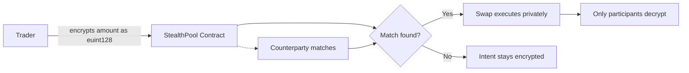

# StealthPool

Confidential dark pool on **Zama fhEVM**.

## Problem

Every swap on a public DEX reveals your trade size, strategy, and intent to everyone — including MEV bots that front-run you.

## Consequence

You get sandwich attacked. Your slippage explodes. Institutions can't trade size without moving the market against themselves.

## Solution

**StealthPool** — encrypted intents on Zama fhEVM. Amounts stay encrypted at the protocol level. No one sees your trade but your counterparty.



## How It Works

1. **Create intent** — Encrypt your swap amount client-side with Zama SDK. Submit the encrypted handle. Amounts use `euint128`.

2. **Match** — Others see your intent exists (address + token pair) but not the size. They match by submitting their own encrypted params.

3. **Settle** — Match stores encrypted. Only you + counterparty can decrypt via Zama ACL. No plaintext touches chain.

## Contracts

| Contract | Address |
|----------|---------|
| StealthPool | `0x9754ce1CBb685d7269e52e67e92A3130bDCd04e9` (Sepolia) |
| StealthPoolHook | Uniswap v4 hook — Foundry project in `/hooks` |

## Tests

```
12/12 passing
```

## Stack

- **FHE**: Zama fhEVM (`euint128`, `externalEuint128`)
- **Chain**: EVM + fhEVM coprocessor (Sepolia deployed)
- **Frontend**: Next.js 16 + HeroUI + wagmi
- **SDK**: `@zama-fhe/relayer-sdk`

## Quick Start

```bash
npm install
npx hardhat test         # 12 tests
cd frontend && npm install && npm run dev
```

Config in `frontend/lib/config.ts` (not env). Secrets only: `NEXT_PUBLIC_INFURA_KEY` in `.env.local`.

## Deploy

```bash
npx hardhat run scripts/deploy-pool.ts --network sepolia
```

## License

BSD-3-Clause-Clear
